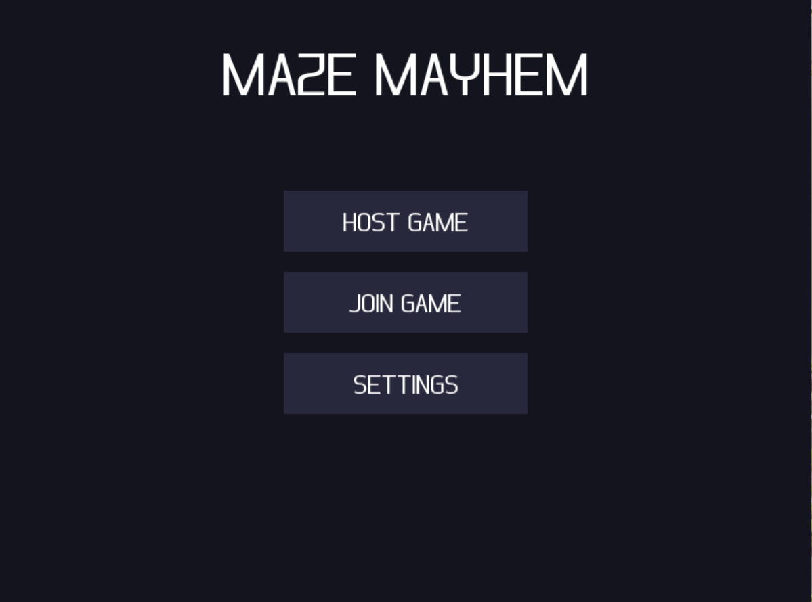
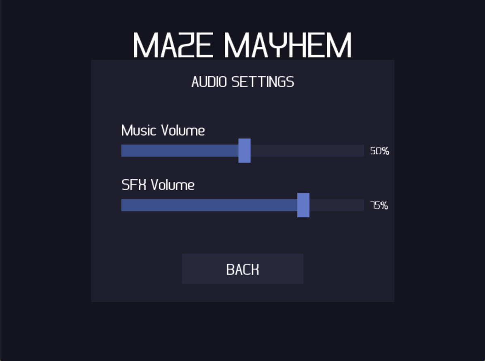
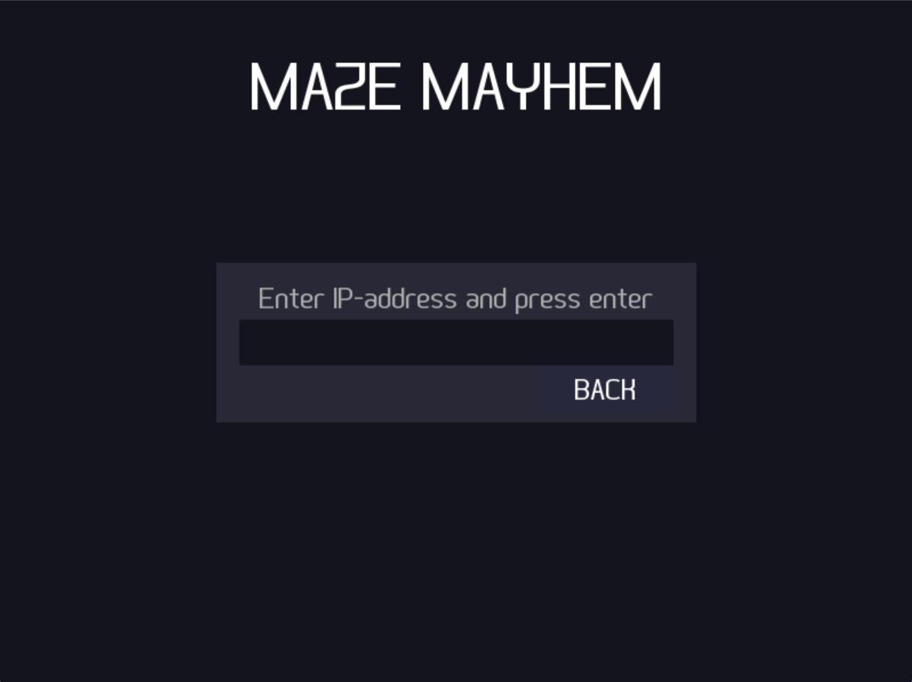
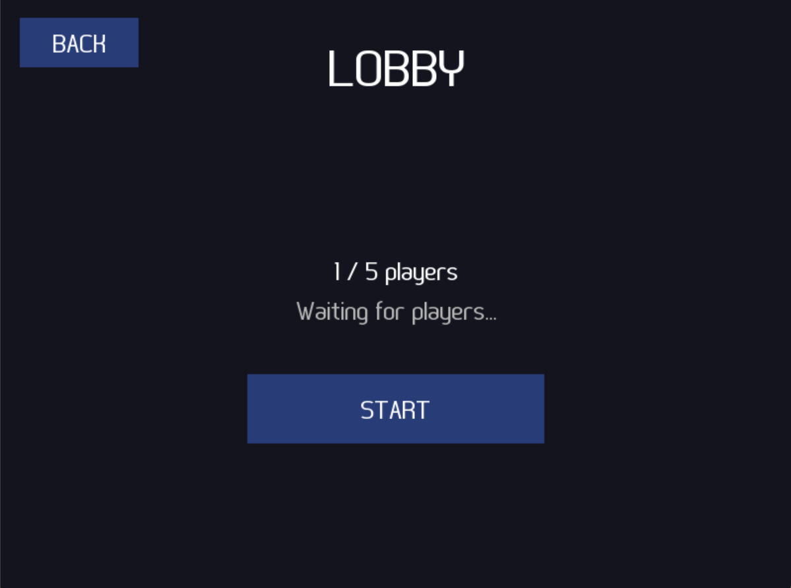
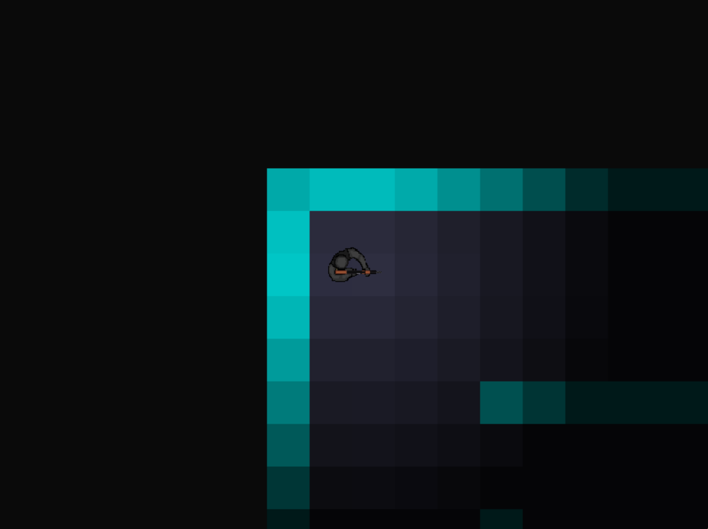

# 🧩 Maze Mayhem

**Maze Mayhem** is a 2D multiplayer maze game built in **C** using the **SDL2** library. Players connect over a local area network (LAN) and compete against each other in real time — navigating a maze, shooting at opponents, and surviving under a fog-of-war visibility system. The project was developed as a group assignment using agile/Scrum methodology.

---

## 🎬 Demo

[](https://youtu.be/JCgUJlsKOQw)

> Click the thumbnail to watch the trailer on YouTube.

---

## 📸 Screenshots

<p align="center">
  
  
</p>
<p align="center">
  
  
</p>
<p align="center">
  
</p>

---

## ✨ Features

### 🌐 Multiplayer Networking
- Real-time LAN multiplayer supporting up to **5 players**
- Full **TCP networking layer** built with `SDL2_net`
- Custom binary message protocol with typed headers (`MSG_JOIN`, `MSG_POS`, `MSG_SHOOT`, `MSG_STATE`, `MSG_DEATH`, `MSG_LEAVE`, `MSG_START`)
- Host/client architecture: one player hosts the session, others connect by IP
- Handles join logic, player ID assignment, message parsing, and broadcasting

### 🎮 Gameplay Systems
- **Movement** — smooth player movement with configurable speed across a tile-based maze world
- **Collision detection** — wall-tile and player-projectile collision handling
- **Shooting mechanics** — players can fire projectiles in any direction, with up to 10 active projectiles at once
- **Fog of war** — dynamic visibility system that limits how far players can see, creating tactical tension
- **Spectate mode** — players who die can spectate the ongoing match with a zoomed-out camera view
- **Death screen** — dedicated screen on player elimination

### 🎵 Audio
- Background music playback
- Sound effects for player death

### 🖼️ Rendering
- Tile-based maze rendering using a bitmap tileset
- Per-player sprite textures (5 unique player skins)
- Camera system with zoom support (1.5× gameplay, 0.6× spectate)
- Font rendering via SDL2_ttf

---

## 🏗️ Project Structure

```
Maze-Mayhem/
├── include/
│   ├── audio_manager.h
│   ├── camera.h
│   ├── constants.h
│   ├── game_core.h
│   ├── lobby.h
│   ├── maze.h
│   ├── menu.h
│   ├── network.h
│   ├── player.h
│   └── projectile.h
├── source/
│   ├── client.c          # Entry point; bootstraps game context
│   ├── game_core.c       # Main game loop, rendering, input, update
│   ├── network.c         # TCP networking, message send/receive
│   ├── player.c          # Player creation, movement, rotation
│   ├── projectile.c      # Projectile spawning, movement, collision
│   ├── maze.c            # Maze generation and tile rendering
│   ├── camera.c          # Camera tracking and zoom
│   ├── lobby.c           # Pre-game lobby and player ready state
│   ├── menu.c            # Main menu UI
│   └── audio_manager.c   # Music and SFX playback
├── resources/
│   ├── Tiles.bmp
│   ├── wallTexture.webp
│   ├── player_1.png … player_5.png
│   ├── projectile.png
│   ├── font.ttf
│   ├── backgroundMusic/
│   └── sfx/
└── Makefile
```

---

## 🛠️ Technology Stack

| Component | Technology |
|---|---|
| Language | C (C99) |
| Rendering | SDL2, SDL2_image, SDL2_ttf |
| Networking | SDL2_net (TCP) |
| Audio | SDL2_mixer |
| Build system | GNU Make (cross-platform) |
| Target platforms | macOS, Linux, Windows |

---

## 🚀 Installation & Build

### Prerequisites

Install the following SDL2 libraries for your platform:

**macOS (Homebrew)**
```bash
brew install sdl2 sdl2_ttf sdl2_image sdl2_net sdl2_mixer
```

**Linux (apt)**
```bash
sudo apt install libsdl2-dev libsdl2-ttf-dev libsdl2-image-dev libsdl2-net-dev libsdl2-mixer-dev
```

**Windows**
- Install [MSYS2](https://www.msys2.org/) or [vcpkg](https://vcpkg.io/)
- Via MSYS2 MinGW64:
  ```bash
  pacman -S mingw-w64-x86_64-SDL2 mingw-w64-x86_64-SDL2_ttf mingw-w64-x86_64-SDL2_image mingw-w64-x86_64-SDL2_net mingw-w64-x86_64-SDL2_mixer
  ```

### Build

```bash
git clone https://github.com/YOUR_USERNAME/Maze-Mayhem.git
cd Maze-Mayhem
make
```

This produces an executable named `game` (or `game.exe` on Windows).

To clean build artifacts:
```bash
make clean
```

---

## 🕹️ How to Play

### Starting a Session

**Host (creates the game)**
```bash
./game
```
Select **Host** from the main menu. Other players on the same network connect using the host's local IP address.

**Client (joins the game)**
```bash
./game
```
Select **Join**, enter the host's IP address, and wait in the lobby until the host starts the session.

### Controls

| Key | Action |
|---|---|
| `W` / `A` / `S` / `D` | Move |
| Mouse | Aim |
| Left Click | Shoot |

### Objective

Survive as long as possible by eliminating other players. If you die, you enter spectate mode and can watch the rest of the match from a zoomed-out view.

---

## ⚙️ Configuration

Key constants are defined in `include/constants.h`:

| Constant | Default | Description |
|---|---|---|
| `MAX_PLAYERS` | 5 | Maximum players per session |
| `PLAYERSPEED` | 200 | Player movement speed |
| `FOG_MAX_DIST` | 200.0 | Fog of war visibility radius |
| `PLAYER_VISUAL_DIST` | 350.0 | Distance at which other players become visible |
| `MAX_PROJECTILES` | 10 | Maximum simultaneous projectiles |
| `PROJSPEED` | 400 | Projectile speed |

---

## 📋 Development

This project was developed using **agile/Scrum** methodology:
- Sprint planning and task tracking via **Taiga**
- Work divided into user stories and sprint backlog items
- Regular sprint reviews and retrospectives

---

## 📄 License

This project is licensed under the [MIT License](LICENSE).

---

## 📬 Contact

Questions or feedback? Feel free to reach out:

**Edis Avdic** – edis_123@live.se 
GitHub: [github.com/edisavdicc](https://github.com/YOUR_USERNAME)
